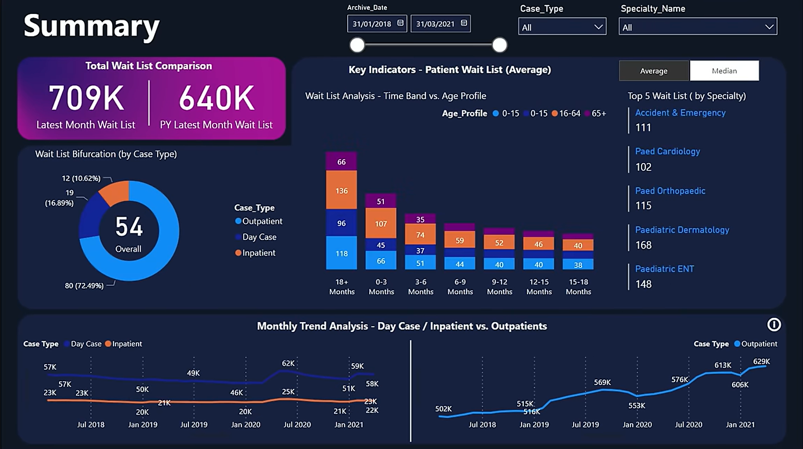
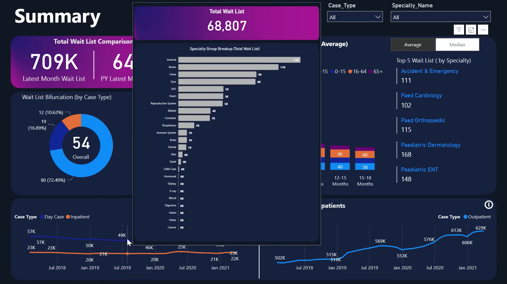
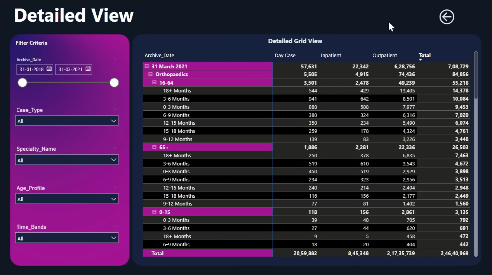

## 📊 **Project Title**

# **Healthcare Patient Waitlist Analytics Dashboard (Power BI)**

---

## 🖼️ Dashboard Previews

### 🔹 Overall Dashboard Summary



---

### 🔹 Specialty Group Breakup (Drill-Through View)



---

### 🔹 Monthly Trend & Detailed Analysis



📌 **Place images inside this folder:**

```
Screenshots/
├── dashboard_summary.png
├── specialty_group_breakup.png
└── monthly_trend_analysis.png
```

---


## 📘 **README.md**

### 🏥 Project Overview

The **Healthcare Patient Waitlist Analytics Dashboard** is a Power BI–based analytics solution designed to visualize, analyze, and monitor healthcare patient waitlists across **case types, specialties, age groups, and time periods**.

This project enables healthcare stakeholders to identify **long waiting durations, specialty-level pressure, and historical trends**, supporting informed decision-making and operational optimization.

---

### 🎯 Objectives

* Track **total patient waitlists**
* Compare **latest month vs previous year**
* Analyze waitlists by:

  * Case Type
  * Specialty & Specialty Group
  * Age Profile
* Understand **waiting time distribution**
* Detect **trend patterns and bottlenecks**

---

### 🗂️ Dataset Description

The dataset includes:

* Archive Date
* Case Type (Outpatient, Day Case, Inpatient)
* Specialty Name & Specialty Group
* Patient Age Group
* Waiting Time Bands (0–3, 3–6, 6–9, 9–12, 12–15, 15–18, 18+ months)

---

### 🧩 Dashboard Components

#### 1️⃣ **Total Wait List Comparison**

* KPI cards showing:

  * **Latest Month Wait List**
  * **Previous Year Latest Month Wait List**
* Enables quick year-over-year comparison

---

#### 2️⃣ **Wait List Bifurcation by Case Type**

* Donut chart:

  * Outpatient
  * Day Case
  * Inpatient
* Displays percentage contribution and overall average

---

#### 3️⃣ **Key Indicators – Patient Wait List**

* Toggle between:

  * **Average**
  * **Median**
* Improves accuracy by reducing outlier impact

---

#### 4️⃣ **Wait Time vs Age Profile Analysis**

* Stacked bar chart:

  * X-axis: Wait Time Bands
  * Stack: Age Groups (0–15, 16–64, 65+)
* Highlights which age group faces longer waits

---

#### 5️⃣ **Top 5 Wait Lists by Specialty**

* Identifies high-demand specialties such as:

  * Accident & Emergency
  * Paediatric Dermatology
  * Paediatric ENT
  * Paed Orthopaedic
  * Paed Cardiology

---

#### 6️⃣ **Specialty Group Breakup (Drill-Through)**

* Shows **Total Wait List count**
* Horizontal bar chart by specialty groups:

  * General
  * Bones
  * Urine
  * Eyes
  * ENT
  * Heart
  * Respiratory, Immune System, etc.

---

#### 7️⃣ **Monthly Trend Analysis**

* Line charts for:

  * Day Case vs Inpatient
  * Outpatients
* Time range: **2018–2021**
* Reveals growth trends and seasonal variations

---

### 🎛️ Interactive Filters

* Archive Date Range Slider
* Case Type Selector
* Specialty Name Selector

🔄 All visuals update dynamically based on selections.

---

### 🛠️ Tools & Technologies

* **Power BI Desktop**
* **DAX (Data Analysis Expressions)**
* **Data Modeling & Relationships**
* **Healthcare Dataset (CSV / Excel)**
* **Custom Dark Theme UI**

---

### 📈 Key Insights

* Outpatients contribute the **largest share** of the waitlist
* Significant backlog exists in **18+ months waiting category**
* Pediatric and emergency specialties show high pressure
* Overall waitlist trend is **increasing over time**

---

### 📂 Project Structure

```
Healthcare-Waitlist-Dashboard/
│
├── Data/
│   └── healthcare_waitlist_data.csv
│
├── Dashboard/
│   └── Healthcare_Waitlist_Dashboard.pbix
│
├── Screenshots/
│   ├── dashboard_summary.png
│   ├── specialty_group_breakup.png
│   └── monthly_trend_analysis.png
│
└── README.md
```

---

### 🚀 Future Enhancements

* Predictive waitlist forecasting
* Hospital-level comparison
* Real-time data integration
* Patient outcome and discharge analytics

---

### 👤 Author

**Kshitij Sinha**
📊 Data Analytics | Power BI | SQL | Excel

---
